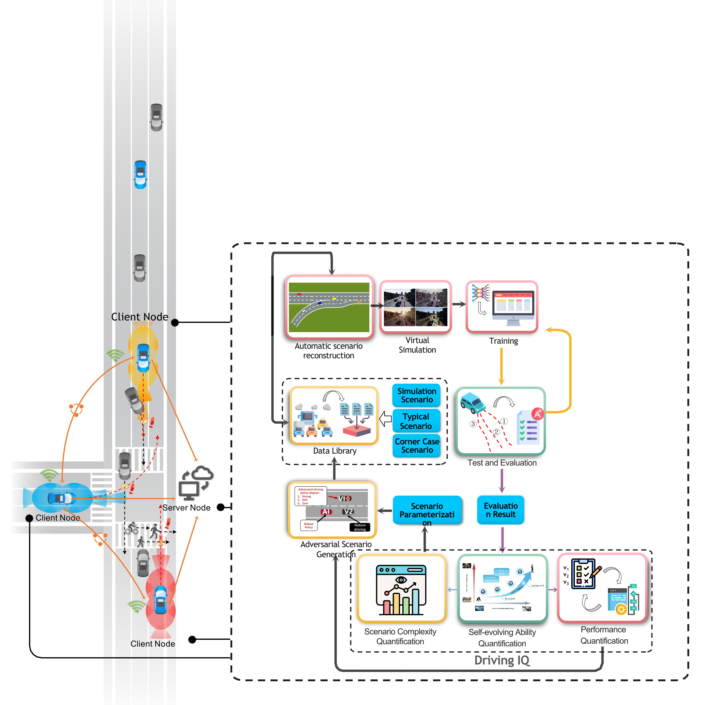

# Framework of Closed Loop Self-learning for autonomous driving

This project enables closed-loop self-learning algorithmic process control for autonomous driving



## Getting Started

This project is based on python3.7, CARLA 0.9.11 and openai-gym


### Prerequisites

Dependent Installation：
```
pip install -r requirements.txt
```


### Running the tests

```
python simulation_env.py
```

## New Features

1. Continuous Training Environment Generation for **Self Learning** and **Adversarial Scenario** 

    _Two stage_: **self_learning_stage** and **adv_scenario_stage**

```
/Carla_gym/envs/gym_env.py                  # A demo environment for agent learner (Car Following)
```

```
/Carla_gym/envs/gym_Scenario_env.py        # A demo environment for adversarial scenario generation (Car Following)
```
The process control script is detailed in：
```
/tools/Closed_loop_TrainingManager/TrainingManager.py        
```
2. **Models save** and **continuous training**. The framework will automatically store all model and process files under different training phases in the corresponding folders

   _files:_ **model_save**, **runs_info**, **eval_info**


   
4. The encapsulated SAC algorithm draws inspiration from stable_baselines3
   
   _note_: ⛔Not good ⛔

```
/SAC/SAC_learner.py   
```
## Problems
```
error:  ERROR:root:time-out of 10000ms while waiting for the simulator, make sure the simulator is ready and connected to 127.0.0.1:2000
```
**Just run the code again**. Please set **con_ Learning_ Flag=True** and delete process files & models to ensure that a closed-loop process has ended
